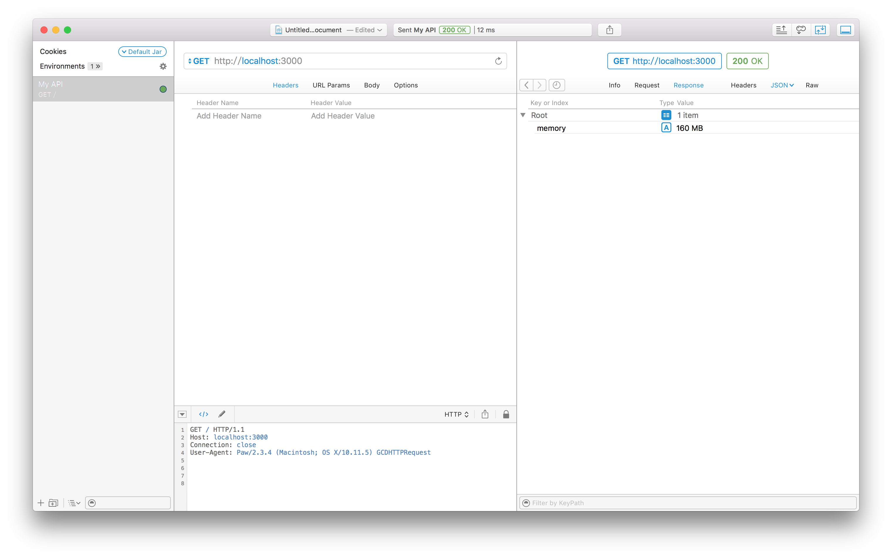

# Nodejs cluster share memory demo

## Getting Started
```javascript
git clone https://github.com/Karolass/node-cluster-shareMemory.git
npm install
node app.js
```

### execution


### request and response

